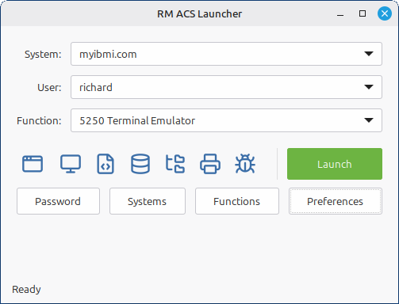
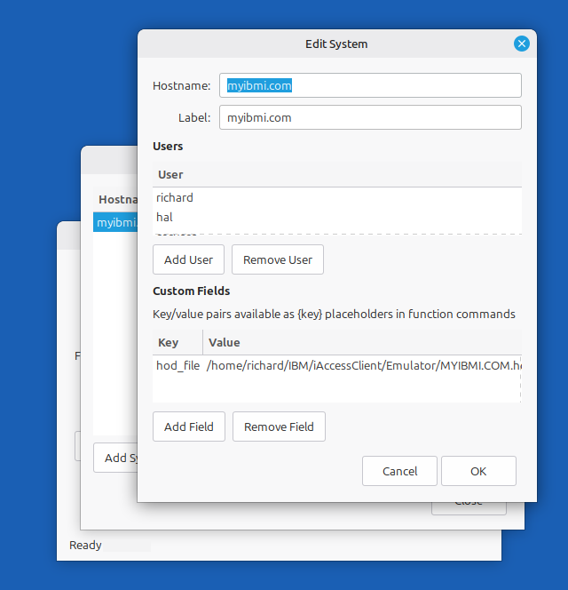
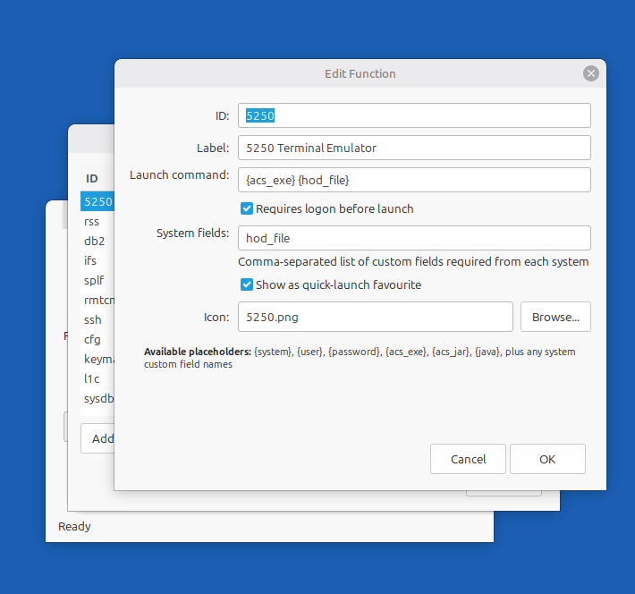

# RM ACS Launcher

A GTK3 desktop application for Linux that provides a point-and-click interface for launching [IBM i Access Client Solutions (ACS)](https://www.ibm.com/support/pages/ibm-i-access-client-solutions) tools.

The application allows selection of system, user and function. User passwords are stored in the GNOME Keyring allowing the application to allow easy selection of the user used to launch the application, which is cumbersome when using the ACS launcher.



## Features

- **Quick Launch** — Select system, user, and function from dropdowns, then click Launch
- **Favourite Icons** — Configurable quick-launch icon buttons for frequently used functions
- **Password Management** — Stores credentials securely in GNOME Keyring via libsecret
- **Custom Systems** — Define IBM i systems with users and custom fields (e.g. HOD session files)
- **Custom Functions** — Configure launch commands with placeholder substitution
- **Automatic Logon** — Optional authentication step before launching a plugin, skipped when the same system/user is already authenticated in the current session
- **ACS Launcher** — One-click button to open the default IBM ACS GUI
- **Remembers Selections** — Restores your last system, user, and function on startup
- **Desktop Integration** — Installs as a standard Linux desktop application

| Systems | Functions |
|:---:|:---:|
|  |  |

## Built-in Functions

| Function | Description | Requires Logon |
|----------|-------------|:--------------:|
| 5250 | Terminal Emulator | Yes |
| rss | Run SQL Scripts | Yes |
| db2 | Database Management | Yes |
| ifs | IFS Browser | Yes |
| splf | Printer Output (Spool Files) | Yes |
| rmtcmd | Remote Command | Yes |
| l1c | Navigator for i | Yes |
| sysdbg | System Debugger | No |
| ssh | SSH Terminal | No |
| cfg | System Configuration | No |
| keyman | Certificate Management | No |

Details of the ACS command-line options can be found here: [IBM i Access - ACS Getting Started]([ibm-i-access-acs-getting-started](https://www.ibm.com/support/pages/ibm-i-access-acs-getting-started))

## Requirements

- Python 3
- GTK 3 (PyGObject)
- libsecret (GNOME Keyring)
- IBM i Access Client Solutions installed locally
  - The systems must already be defined within ACS
  - The *Connection* > *Password Prompting* selection must be set to *Use Shared Credentials*

### Installing dependencies on Debian/Ubuntu/Mint

```bash
sudo apt install python3 python3-gi gir1.2-secret-1
```

## Installation

1. Clone or download this repository:

```bash
git clone https://github.com/richardm90/rm-acs-launcher.git
cd rm-acs-launcher
```

2. Run the install script:

```bash
./install.sh
```

This installs the application to `~/.local/share/rm-acs-launcher/`, creates a launcher script at `~/.local/bin/rm-acs-launcher`, and adds a desktop entry so the app appears in your application menu.

Once installed, the source repository is no longer needed and can be removed.

3. Create a link to a central configuration file (optional):

The configuration settings within rm-acs-launcher are stored locally in `~/.config/rm-acs-launcher/config.json`. If you'd like to point to a central configuration file shared across multiple machines you can easily achieve this with a symlink.

```bash
mkdir -p ~/.config/rm-acs-launcher
ln -s ~/Documents/config/rm-acs-launcher/config.json ~/.config/rm-acs-launcher/config.json
```

In this example `~/Documents/config/rm-acs-launcher/config.json` is the central configuration file.

4. Launch from the application menu, or from the terminal:

```bash
rm-acs-launcher
```

### Updating

To update, pull the latest changes and re-run the install script:

```bash
cd rm-acs-launcher
git pull
./install.sh
```

## Uninstallation

```bash
./uninstall.sh
```

This removes the application files, launcher script, and desktop entry. Configuration files in `~/.config/rm-acs-launcher/` and saved passwords in GNOME Keyring are preserved.

## Configuration

Configuration is stored at `~/.config/rm-acs-launcher/config.json`. You can edit settings through the Preferences dialog in the app, or edit the file directly.

See [data/config.example.json](data/config.example.json) for an example.

### Preferences

| Setting | Default | Description |
|---------|---------|-------------|
| ACS executable | `/opt/ibm/iAccessClientSolutions/Start_Programs/Linux_x86-64/acslaunch_linux-64` | Path to the ACS launcher binary |
| ACS jar path | `/opt/ibm/iAccessClientSolutions/acsbundle.jar` | Path to the ACS bundle jar |
| Java path | `/usr/bin/java` | Path to the Java runtime |
| Java options | `-Xmx1024m` | JVM arguments |
| Logon command | `{acs_exe} /plugin=logon /system={system} /userid={user} /auth /gui=0` | Command used for authentication |

### Placeholders

Launch and logon commands support these placeholders:

| Placeholder | Source |
|-------------|--------|
| `{system}` | Selected system hostname |
| `{user}` | Selected username |
| `{password}` | Password from keyring or manual entry |
| `{acs_exe}` | ACS executable path from preferences |
| `{acs_jar}` | ACS jar path from preferences |
| `{java}` | Java path from preferences |
| `{custom_field}` | Any custom field defined on the system |

## Credential Handling

- **Storage** — Saved passwords live in your GNOME Keyring (Secret Service API), encrypted at rest and unlocked by your login session. The launcher's `~/.config/rm-acs-launcher/config.json` never contains plaintext credentials.
- **Logon** — When the launcher needs to authenticate, the password is fed to ACS through a pseudo-terminal (PTY) rather than placed on the command line. This keeps it out of `/proc/<pid>/cmdline`, where it would otherwise be readable by any other local user for the duration of the logon process. Custom `logon_cmd` templates that still include `{password}` fall back to the original argv-based behaviour for backwards compatibility, but this is no longer recommended.
- **File permissions** — `~/.config/rm-acs-launcher/` is `0700` and `config.json` is `0600`. Existing installs are tightened on the next save.

## Versioning

The application uses [semantic versioning](https://semver.org/) (`major.minor.patch`). The version is defined in a single place: `acs_launcher/__init__.py`.

The current version is displayed in the status bar when the application starts.

### Release Process

1. Update the version in `acs_launcher/__init__.py`
2. Update `CHANGELOG.md` — move Unreleased entries under the new version heading
3. Commit the change:
   ```bash
   git commit -am "Release v0.2.0"
   ```
3. Tag the release:
   ```bash
   git tag v0.2.0
   ```
4. Push with tags:
   ```bash
   git push && git push --tags
   ```

Users update by pulling the latest changes and re-running the install script:

```bash
cd rm-acs-launcher
git pull
./install.sh
```

The installed version can be checked without running the app:

```bash
cat ~/.local/share/rm-acs-launcher/VERSION
```

## Acknowledgements

Function icons in `data/icons/` are derived from [Lucide](https://lucide.dev/) (ISC license).

## Trademarks

IBM, IBM i, and IBM i Access Client Solutions are trademarks of International Business Machines Corporation, registered in many jurisdictions worldwide.

This project is an independent community tool and is not affiliated with, sponsored by, or endorsed by IBM.

## Project Structure

```
rm-acs-launcher/
├── acs_launcher/
│   ├── main.py              # Application entry point
│   ├── window.py            # Main window UI and launch logic
│   ├── launcher.py          # Command substitution and process execution
│   ├── config.py            # Configuration load/save
│   ├── passwords.py         # GNOME Keyring integration
│   └── dialogs/
│       ├── password_dialog.py          # Password entry dialog
│       ├── system_manager_dialog.py    # System/user management
│       ├── function_manager_dialog.py  # Function/command management
│       └── preferences_dialog.py       # Application preferences
├── data/
│   ├── icons/                      # Bundled function icons
│   ├── config.example.json         # Example configuration
│   ├── rm-acs-launcher.desktop     # Desktop entry template
│   └── rm-acs-launcher.png         # Application icon
├── install.sh
├── uninstall.sh
├── CHANGELOG.md
└── README.md
```
